# Zephyr

A Nintendo Game Boy and Game Boy Color emulator.

## About

My goal with this project was simply to learn more about the hardware of Nintendo's Game Boy and Game Boy Color consoles while building something cool :)

## Features

* Emulation of the Game Boy and Game Boy Color
* Hardware accurate emulation (an ongoing goal more than a feature), including:
  * CPU: The DI+HALT hardware bug
  * LCD: Inaccessible VRAM and OAM
  * LCD: Limit of 10 sprites per line
  * LCD: Variable length Mode 3
* ROM Only, MBC1, MBC3 and MBC5 cartridge types
* MBC3 RTC support
* Battery saves
* Passes Blargg's CPU instructions and instruction timing tests
* Turbo mode

## Screenshots

### Games

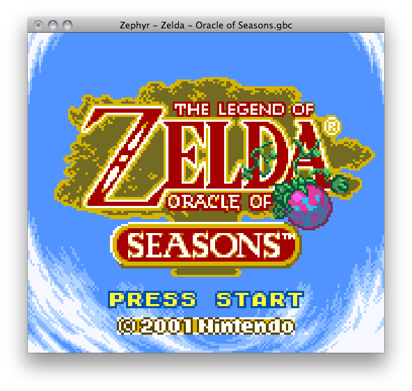
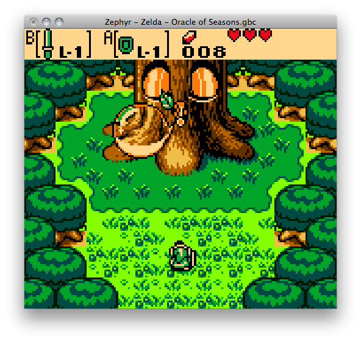
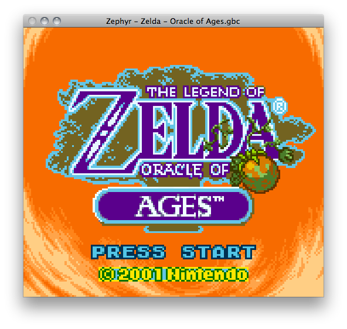
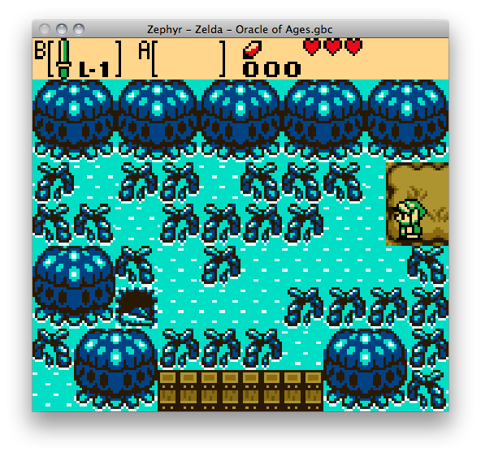
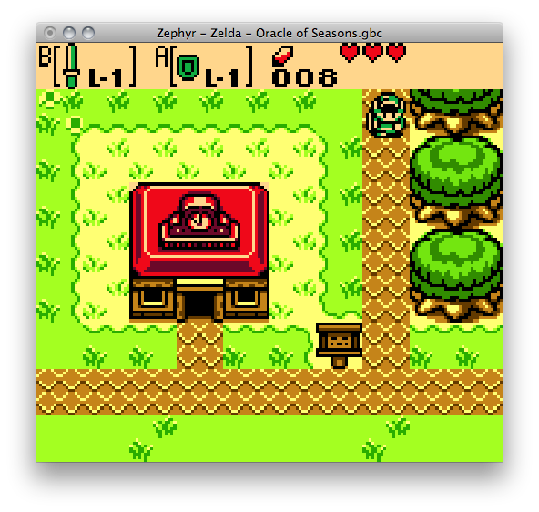
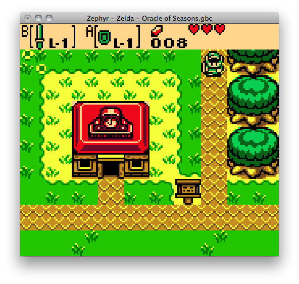
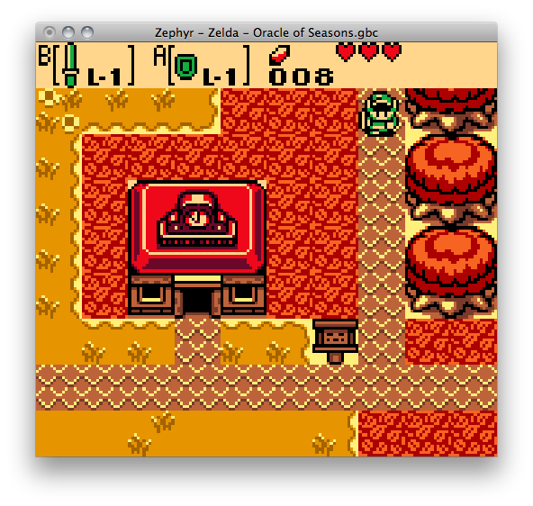
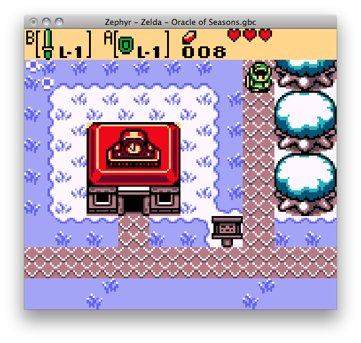
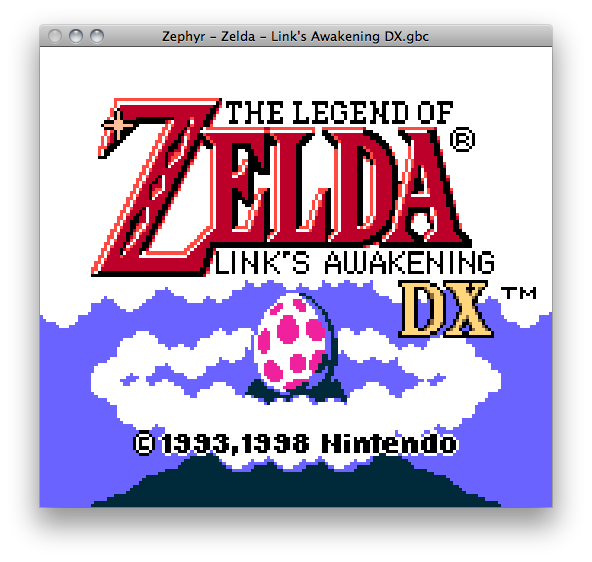
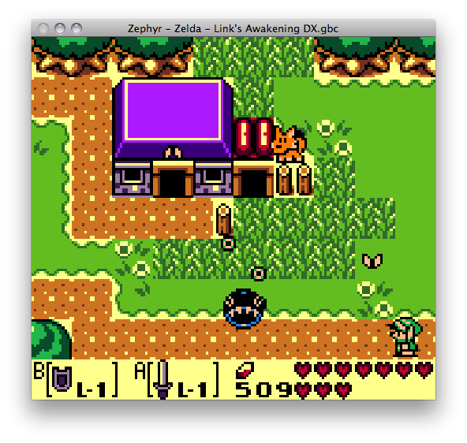
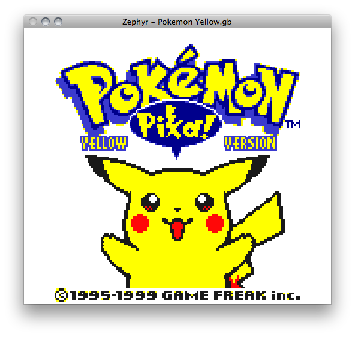
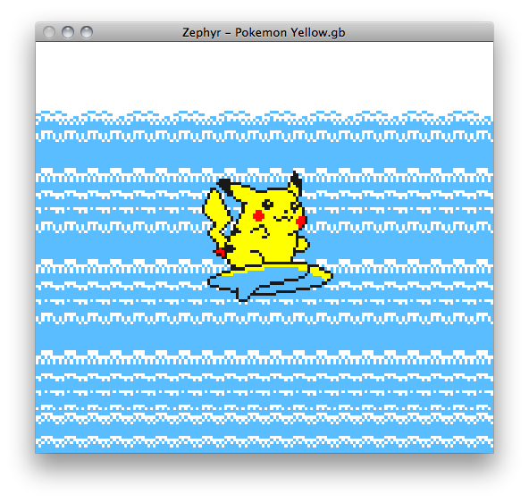
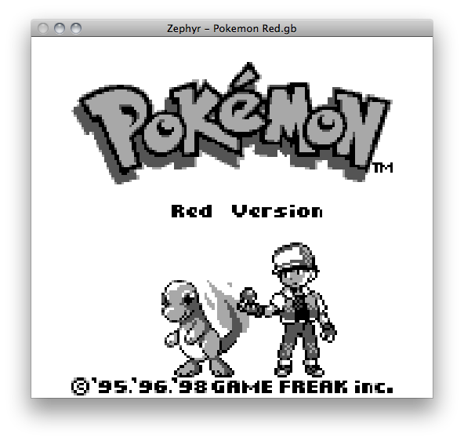
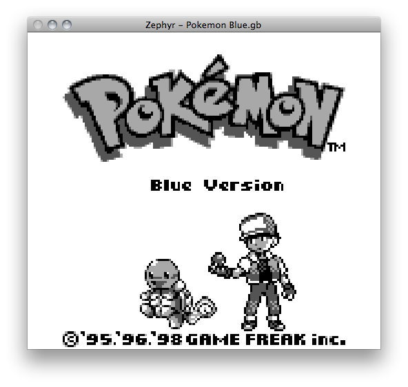

### Blargg's Tests

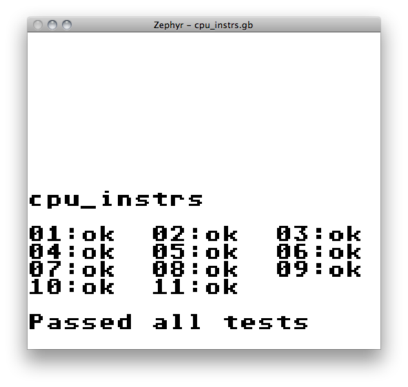
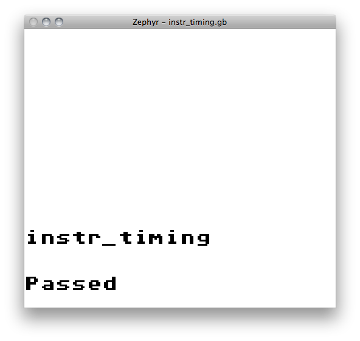

## Roadmap

* Sound support (including output to files containing individual or combined channels)
* Serial data transfer (including TCP/IP game link support for totally rad remote Pokémon battling and trading)
* Save states
* MBC2 cartridge type support
* Emulation accuracy, in order to run *those* games such as Prehistorik Man, Demotronic, etc.
* Graphics upscaling
* VBA-compatible MBC3 RTC save format
* And more to come...
